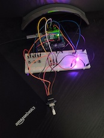
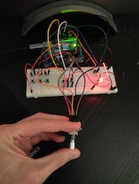
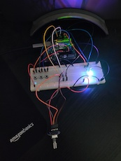

# Project
## Introduction
To get a better understanding of the workings of timers and how to apply them, a small experiment is created that allows for mimicking the entire color spectrum through an RGB LED.  

This can be achieved through selecting a color by the push of a button, then per each clockwise tick of the rotary encoder, the value for that LED color is increased within the range [0, 255]. This increases the duty cycle in fast PWM mode and the LED color will appear brighter.

## Features
1. Color selection through 3 pushbuttons, one for each color red, green, blue.
2. Modify on-time/duty cycle of a selected color through a rotary encoder.
3. Reset a selected color to 0 on-time (hacky but pin is pulled low).

## Display
In the first image (reading left to right) both red and blue are selected and given some value through twisting the rotary encoder some times.  
The last selected color is reset through the rotary encoder's push button (image in middle).  
In the last image, three colors are provided mimicking white light.  
  
